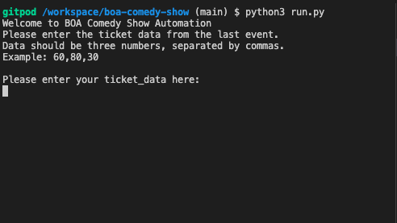
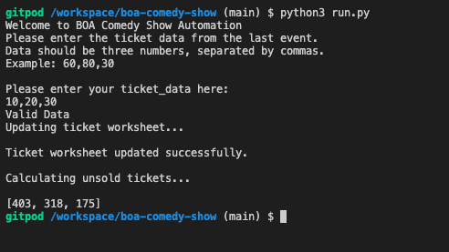
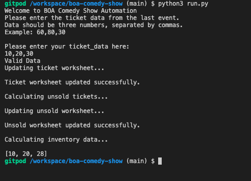

# BOA Comedy Show 

Boa Comedy Show is a python survey input that collects sales numbers from the user, calculate unsold tickets and recommend sales numbers for each caetgory of tickets for their future event.

## Introduction
The show is an annual comedy show that sells different categories of tickets for their event.

For each event the organizers pre-sell tickets, if they sell out of a particular category, the organizers print more tickets to sell while the unsold ones are thrashed after the event.

## Our main goal
Our goal is to save the company some time by automating a repetitive task and help reduce the unsold tickets by better predicting ticket sales for future events.

https://boa-comedy-show.herokuapp.com/

## How it works
<ul>
<li>
Our program will collect ticket-sales numbers from the user
</li>
<li>
Validate the numbers collected are integers and valid
</li>
<li>
The numbers will be added to our ticket-sales worksheet
</li>
<li>
We will then calculate the unsold tickets
</li>
<li>
Update the unsold tickets worksheet
</li>
<li>
Calculate the average ticket sales for the last 3 events
</li>
<li>
Update calculated future-tickets numbers into the future-tickets worksheet
</li>
<li>
Print Recommendations
</li>
</ul>

## Features
<ul>
    <li>Request ticket sales numbers from the user
    </li>
        <ul>
        <li>validate numbers to ensure the user has provided exactly 3 numbers
        </li>
        <li>validate numbers to ensure the values are all integers
        </li>
        <li>create while loop to repeat request for numbers until valid
        </li>
        <li>update our ticket worksheet
        </li>
        </ul>

   <li>Calculate the unsold-tickets
    </li>
        <ul>
        <li>compare tickets sold with the inventory inorder to calculate the unsold (if any) for each category
        </li>
        <li>calculate the unsold tickets
        </li>
        <li>updates the unsold worksheet in our spreadsheet
        </li>
        </ul>

<li>Calculate inventory based on averages from the last 3 events
</li>
    <ul>
    <li>calculate the average inventory
    </li>
    <li>the user adds a 20% margin to the calculated averages for future events
    </li>
    <li>updates our inventory worksheet
    </li>
    <li>make recommendations
    </li>
    </ul>

    
</ul>

## Data Model

 We imported a spreadsheet from google sheet, where we have our survey data 

Our spreadsheet has 3 columns for the different categories of ticket-sales

It contains 10 rows of numbers from past events

It has 3 worksheets for ticket-sales, unsold tickets and future-tickets 

## Testing
I have manually tested this project by doing the following:
<ul>
<li>I passed the codes through a PEP8 and confirmed there are no errors
</li>
<li>It gives valid input, strings and float numbers are not allowed.
</li>
<li>Tested in my local terminal and the Code Institute Heroku terminal
</li>
</ul>

## Bugs

At the point of deplomyent to Heroku, I could not connet to git connect, i was getting 'internal servive error'. However i was able to deploy through git CLI

## Validator Testing
<ul>
<li>PEP8
    <ul>
    <li>No errors were returned from pep8online.com
    </li>
    </ul>
</li>
</ul>

## Deployment
<ul>
<li> Steps for Deployment
</li>
    <ul>
    <li>Create a new app
    </li>
    <li>Set my config vars to store my sensitive data
    </li>
    <li>Set the buildbacks to Python and NodeJS in that order
    </li>
    <li>Click on deploy
    </li>
    </ul>
</ul>

## Credits
<ul>
<li>Love sandwiches walkthrough project
</li>
<li>Sample Readme from Ultimate Battleship
</li>
<li>Tutor support
</li>
</ul>